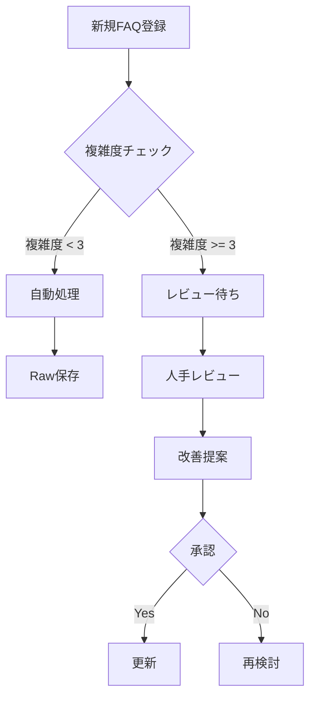
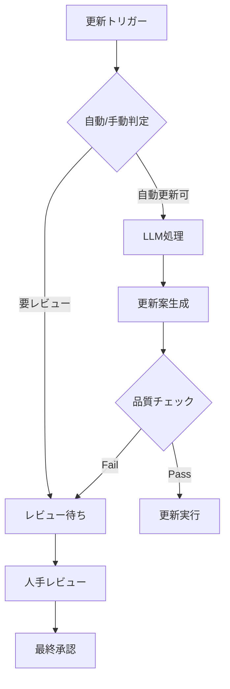

# FAQ知識ベースのハイブリッド運用設計

## 1. 基本方針

### 1.1 データ管理の一元化
- **Raw型を主軸に据えた一元管理**
  - すべてのナレッジはRaw型で保存
  - メンテナンス性と将来の拡張性を確保
  - 複雑なクエリにも対応可能な柔軟性を維持

### 1.2 人手介入の最適化
- **"必要な時だけ"の人手介入**
  - 自動化を基本としつつ、品質向上が必要な場合のみ人手を介入
  - コストと品質のバランスを重視
  - 運用負荷を最小限に抑制

## 2. システム構成

### 2.1 データベース設計
```sql
-- Raw型ナレッジ（基本テーブル）
CREATE TABLE faq_raw (
    id SERIAL PRIMARY KEY,
    question TEXT NOT NULL,
    answer TEXT NOT NULL,
    category TEXT,
    tags TEXT[],
    complexity INT,  -- 1: 基本的, 2: 中程度, 3: 複雑
    requires_review BOOLEAN DEFAULT false,
    review_reason TEXT,
    embedding vector(1536),
    created_at TIMESTAMP WITH TIME ZONE DEFAULT CURRENT_TIMESTAMP,
    updated_at TIMESTAMP WITH TIME ZONE DEFAULT CURRENT_TIMESTAMP
);

-- 人手レビュー履歴
CREATE TABLE faq_review_history (
    id SERIAL PRIMARY KEY,
    faq_id INT REFERENCES faq_raw(id),
    original_answer TEXT,
    refined_answer TEXT,
    review_type TEXT,  -- 'quality_check', 'refinement', 'correction'
    reviewer TEXT,
    review_date TIMESTAMP WITH TIME ZONE DEFAULT CURRENT_TIMESTAMP
);

-- レビュートリガー条件
CREATE TABLE faq_review_triggers (
    id SERIAL PRIMARY KEY,
    condition_type TEXT,  -- 'complexity', 'feedback', 'usage_frequency'
    threshold JSON,  -- 条件のしきい値（例: {"complexity": 3, "negative_feedback": 2}）
    is_active BOOLEAN DEFAULT true
);
```

### 2.2 自動化パイプライン
1. **入力処理**
   - 新規FAQ登録時の自動カテゴリ分類
   - 複雑度スコアの算出
   - embedding生成

2. **品質管理**
   - LLMによる自動品質チェック
   - レビュートリガー条件の監視
   - 定期的な使用状況分析

3. **応答生成**
   - コンテキストに応じた動的な応答生成
   - ユーザーフィードバックの収集
   - パフォーマンス指標の追跡

## 3. レビュートリガーの設定

### 3.1 自動トリガー条件
1. **複雑度ベース**
   - 複雑度スコアが3（複雑）の場合
   - 複数のカテゴリに跨がる回答
   - 条件分岐を含む回答

2. **フィードバックベース**
   - 否定的フィードバックが一定数を超えた場合
   - 同じ質問の繰り返し問い合わせ
   - 回答の正確性に関する指摘

3. **使用頻度ベース**
   - 高頻度で使用される回答
   - 重要度の高いカテゴリの回答
   - 季節性のある情報の更新時期

### 3.2 手動レビュー基準
1. **必須レビュー**
   - 法的要件に関わる情報
   - 料金体系の変更
   - 重要な運用ポリシーの変更

2. **推奨レビュー**
   - サービス内容の大幅な変更
   - 新機能の追加
   - UI/UXの変更に伴う手順の更新

## 4. 実装フロー

### 4.1 新規ナレッジ登録


### 4.2 既存ナレッジ更新


## 5. 品質管理指標

### 5.1 自動モニタリング指標
- 応答時間
- 正確性スコア
- ユーザー満足度
- 再質問率
- 回答の一貫性

### 5.2 定期レビュー指標
- カバレッジ率
- 情報の鮮度
- カテゴリバランス
- 用語の統一性
- メンテナンス効率

## 6. 運用ガイドライン

### 6.1 日常運用
1. **自動処理の優先**
   - 基本的なFAQは自動処理を信頼
   - システムの判断を尊重
   - 不要な人手介入を避ける

2. **例外処理の明確化**
   - レビュートリガー条件の定期的な見直し
   - 人手介入の基準を明確に文書化
   - 判断に迷う場合の相談フロー

### 6.2 定期メンテナンス
1. **月次レビュー**
   - パフォーマンス指標の確認
   - トリガー条件の調整
   - 新規パターンの発見

2. **四半期レビュー**
   - 大規模な内容更新
   - カテゴリ構成の見直し
   - 運用フローの改善

## 7. 今後の展開

### 7.1 短期的な改善（〜3ヶ月）
- レビュートリガー条件の最適化
- 自動品質チェックの精度向上
- 運用負荷の定量的な測定

### 7.2 中長期的な改善（3ヶ月〜）
- AI判断精度の向上
- より柔軟な応答生成
- 運用自動化の範囲拡大

## 8. 注意点と制約

### 8.1 システム面
- パフォーマンスへの影響を最小限に
- データの整合性を常に維持
- バックアップ体制の確保

### 8.2 運用面
- 急な仕様変更への対応
- 季節変動への準備
- 担当者の育成と引継ぎ

---

この設計により、Raw型の一元管理というシンプルさを保ちながら、必要な場合のみ人手による品質向上を図る効率的な運用が可能になります。 