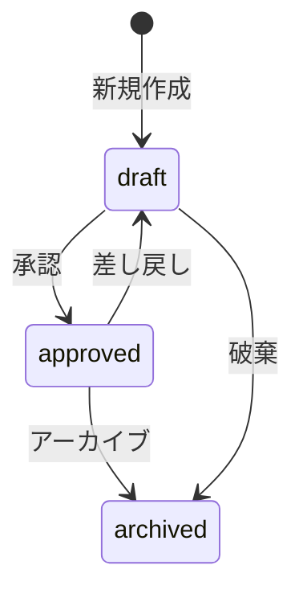

# テンプレート管理API設計

## 1. API エンドポイント

### テンプレート管理

```typescript
// テンプレートステータス更新
PATCH /api/templates/:id/status
{
  "status": "approved" | "draft" | "archived",
  "comment": string  // 承認/差し戻し理由
}

// テンプレート一覧取得（管理者用）
GET /api/templates
?status=draft,approved  // カンマ区切りで複数指定可
&category=string
&intent=string
&tone=string
&page=number
&limit=number

// テンプレート詳細取得
GET /api/templates/:id

// テンプレート更新
PATCH /api/templates/:id
{
  "category": string,
  "intent": string,
  "tone": string,
  "body": string,
  "variables": {
    [key: string]: {
      type: "string" | "number" | "date",
      value: string | number | string
    }
  },
  "importance": number,
  "frequency": number
}
```

### 承認ログ

```typescript
// 承認履歴取得
GET /api/templates/:id/approval-history
{
  "history": [
    {
      "id": string,
      "template_id": string,
      "old_status": "draft" | "approved" | "archived",
      "new_status": "draft" | "approved" | "archived",
      "comment": string,
      "created_by": string,
      "created_at": string
    }
  ]
}
```

## 2. ステータス遷移ルール



### 遷移可能なステータス

| 現在のステータス | 遷移可能なステータス | 必要な権限 |
|------------|-------------|---------|
| draft      | approved    | approver |
| draft      | archived    | editor   |
| approved   | draft       | approver |
| approved   | archived    | approver |
| archived   | -           | -        |

## 3. RLSポリシー

```sql
-- テンプレート閲覧（一般ユーザー）
CREATE POLICY "view_approved_templates" ON templates
    FOR SELECT
    TO authenticated
    USING (status = 'approved');

-- テンプレート閲覧（管理者）
CREATE POLICY "view_all_templates_admin" ON templates
    FOR SELECT
    TO authenticated
    USING (
        auth.jwt() ->> 'role' IN ('admin', 'editor', 'approver')
    );

-- テンプレート編集（編集者）
CREATE POLICY "edit_draft_templates" ON templates
    FOR UPDATE
    TO authenticated
    USING (
        status = 'draft' AND
        auth.jwt() ->> 'role' IN ('admin', 'editor')
    )
    WITH CHECK (
        status = 'draft' AND
        auth.jwt() ->> 'role' IN ('admin', 'editor')
    );

-- ステータス変更（承認者）
CREATE POLICY "change_template_status" ON templates
    FOR UPDATE
    TO authenticated
    USING (
        auth.jwt() ->> 'role' IN ('admin', 'approver')
    )
    WITH CHECK (
        auth.jwt() ->> 'role' IN ('admin', 'approver')
    );
```

## 4. ユースケース

### UC1: テンプレート承認フロー

1. **編集者がテンプレートを作成/編集**
   - ステータス: draft
   - 変数の型チェック
   - 必須項目の検証

2. **承認者がレビュー**
   - 内容確認
   - 変数の使用方法チェック
   - トーンの適切性確認

3. **承認/差し戻し判断**
   - 承認 → approved
   - 差し戻し → draft + コメント
   - アーカイブ → archived

### UC2: 一括承認

1. **複数テンプレートの選択**
   - 同一カテゴリ/intent内
   - ステータスチェック（全てdraft）

2. **一括承認実行**
   - トランザクション管理
   - 承認ログの一括作成

### UC3: テンプレート検索・フィルタリング

1. **管理者向け検索**
   - 全ステータス表示
   - カテゴリ/intent/トーンでフィルタ
   - 承認待ち優先表示

2. **一般ユーザー向け検索**
   - 承認済みのみ表示
   - カテゴリ/intent/トーンでフィルタ

## 5. エラーハンドリング

### ステータス変更エラー

```typescript
interface StatusChangeError {
  code: 
    | "INVALID_TRANSITION"    // 不正な遷移
    | "INSUFFICIENT_ROLE"     // 権限不足
    | "TEMPLATE_NOT_FOUND"    // テンプレート未存在
    | "CONCURRENT_UPDATE";    // 競合更新
  message: string;
  details?: {
    current_status: string;
    requested_status: string;
    allowed_transitions: string[];
  };
}
```

### バリデーションエラー

```typescript
interface ValidationError {
  code: 
    | "INVALID_VARIABLES"     // 変数型ミスマッチ
    | "REQUIRED_FIELD"        // 必須項目不足
    | "INVALID_FORMAT";       // フォーマットエラー
  message: string;
  field: string;
  details?: unknown;
}
```

## 6. 運用ガイドライン

### 承認基準

1. **変数の妥当性**
   - 型の正しさ
   - 命名の一貫性
   - デフォルト値の適切性

2. **トーンの一貫性**
   - カテゴリ内での統一感
   - 緊急/通常の使い分け

3. **テンプレート品質**
   - 文法的正確性
   - 変数の使用方法
   - メッセージの明確さ

### 運用フロー

1. **日次確認**
   - 承認待ちテンプレートの確認
   - 緊急性の高いものを優先

2. **週次レビュー**
   - 新規テンプレートの傾向確認
   - カテゴリ/intentの整理

3. **月次メンテナンス**
   - 低使用率テンプレートの見直し
   - アーカイブ候補の選定

## 7. 監視・メトリクス

### 収集項目

1. **承認関連**
   - 承認待ち時間
   - 差し戻し率
   - カテゴリ別承認数

2. **使用状況**
   - テンプレート使用頻度
   - カテゴリ別使用率
   - 変数使用パターン

### アラート条件

1. **承認遅延**
   - 24時間以上未承認
   - 緊急テンプレートは4時間

2. **異常検知**
   - 大量の差し戻し
   - 急激な使用率低下 